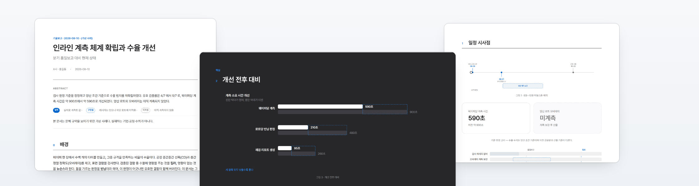
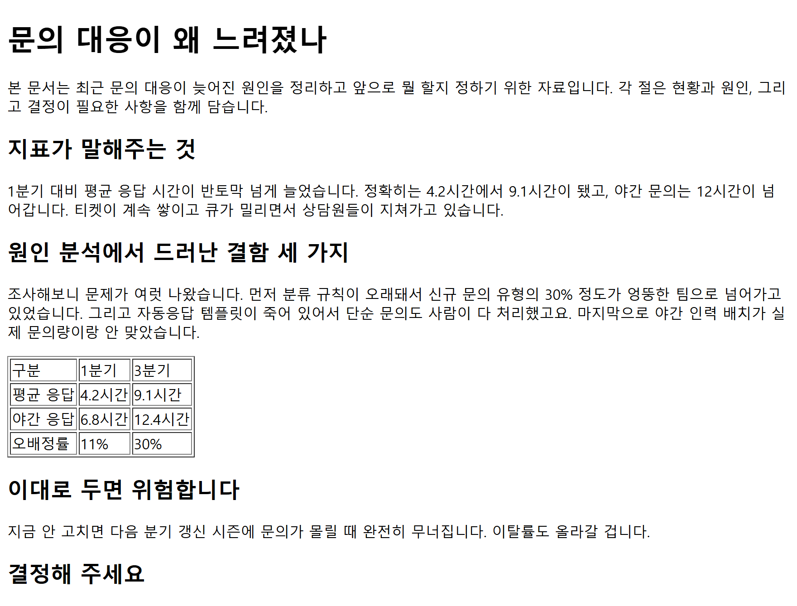
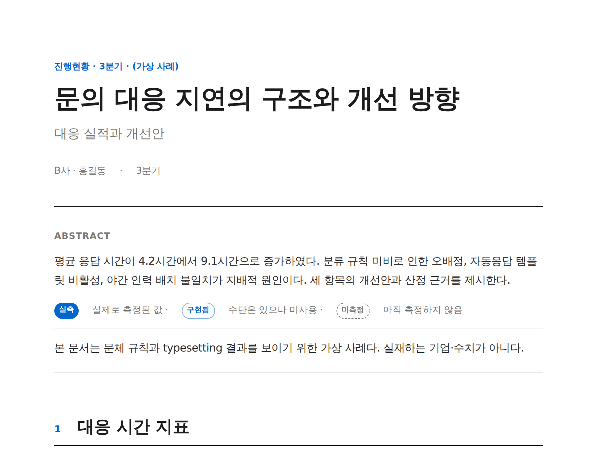
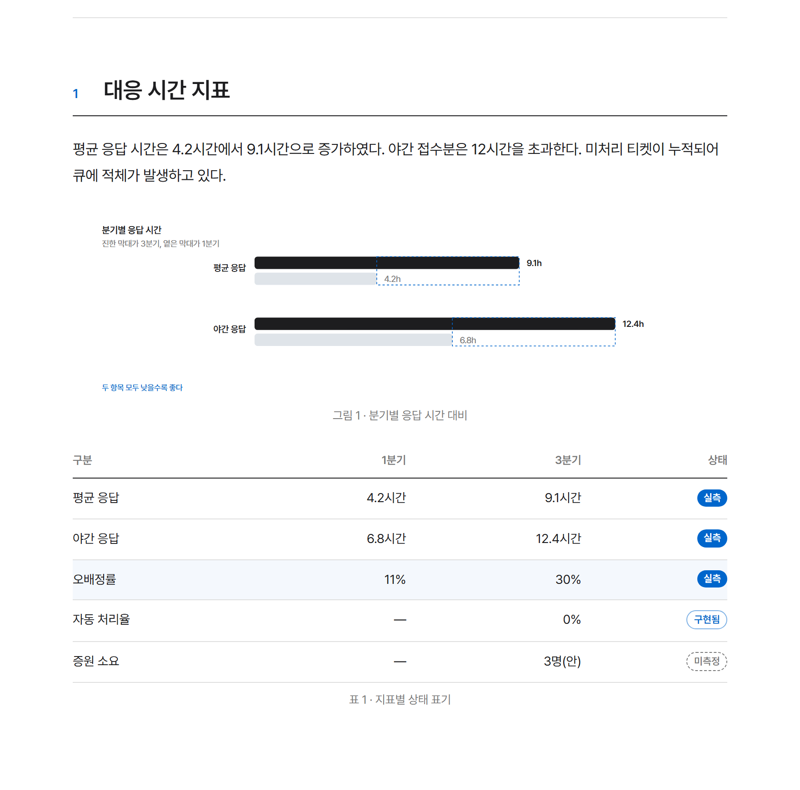

 <b>korean-report-skills</b>

[](../../actions)
[](../../releases)
[](INSTALL.md)
[](LICENSE)

# 왜 Claude가 만든 한국어 문서는 어딘가 이상할까

내용은 맞는데 **문서로 전달하기가 망설여지는** 경험. 그 이유를 다섯 가지로 나누고
각각을 규약으로 구성한 스킬셋입니다.

Claude Code · Codex · Cursor 에 적용 가능합니다. →
[설치](#설치)

<picture>
  <source media="(prefers-color-scheme: dark)" srcset="docs/assets/banner-dark.png">
  
</picture>

paper(세로·보고서) · deck(가로·협의자료) — HTML 파일 하나로 구성됩니다.
---

## "디자인이 별로예요"

마크다운을 워드에 붙이면 볼품없고, HTML로 뽑으면 **매번 다르게 생깁니다.**
제목 크기도, 표 모양도, 여백도 그때그때 달라집니다.

**→ 디자인 시스템을 고정했습니다.** 액센트 색 하나, 그림자 없음, 표에 세로 괘선 없음.
paper(세로·보고서)와 deck(가로·협의자료) 두 모드뿐이고 섞을 수 없습니다.
같은 요청에 같은 결과가 나옵니다.

<table>
<tr>
<th width="50%">전 — 그냥 만들었을 때</th>
<th width="50%">후 — 스킬 적용</th>
</tr>
<tr>
<td></td>
<td></td>
</tr>
</table>

## "문장이 번역체 같아요"

`됐다`와 `하였습니다`가 한 문서에 섞이고, `~하는 것`·`~에 걸려 있다` 같은
번역투가 남습니다. 읽는 사람에게 **초안처럼** 보입니다.

**→ 치환 목록 115건과 어미 규약.** 평서체와 합니다체를 섞지 않고,
필요하면 문서와 커버레터를 분리합니다.

| 그냥 쓰면 | 규약 적용 |
|---|---|
| 반토막 넘게 늘었습니다 | 4.2시간에서 9.1시간으로 증가하였다 |
| 모든 사슬이 승인 하나에 걸려 있다 | 승인 이후 착수할 수 있다 |
| 각 절은 근거를 함께 갖는다 | 각 절에 근거를 명시하였다 |

## "단어를 뭉뚱그려 써요"

`넘긴다`가 **전달인지 이관인지 위임인지** 알 수 없습니다. 업무분장·계약 문서에서
이 한 단어에 책임 범위가 걸립니다.

**→ 광의 고유어를 협의 한자어로 가르는 표 24행, 그리고 판정법.**
목적어를 바꿔 끼워 서로 다른 종류가 모두 자연스러우면 그 동사는 의미역이 넓습니다.

| 광의 | 협의 | 갈라지는 의미 |
|---|---|---|
| 넘긴다 | 전달한다 · 이관한다 · 위임한다 | 데이터인지 업무인지 권한인지 |
| 맞춘다 | 정합한다 · 정렬한다 · 보정한다 | 논리인지 위치인지 값인지 |
| 잡는다 | 검출한다 · 산정한다 · 고정한다 | 이상인지 수치인지 값인지 |

## "숫자를 전부 확정된 것처럼 써요"

추정치와 실측치가 같은 무게로 나열됩니다. 읽는 사람은 어디까지 검증된 값인지
알 수 없고, 그대로 인용했다가 나중에 정정해야 합니다.

**→ 상태를 주장이 있는 자리에 붙입니다.** 범례에만 두지 않습니다.



`실측` 채움 · `구현됨` 외곽선 · `미측정` 파선 — 색이 아니라 **테두리 형태**로
구분하므로 흑백 인쇄에서도 살아남습니다.

## "안 된 것만 나열해서 사고 보고서처럼 읽혀요"

`~가 안 되고 있었다`가 이어지면 같은 사실이라도 문서 전체가 문책 자료가 됩니다.

**→ 주어를 '결함'에서 '개선'으로 옮깁니다.** 사실을 지우지 않으면서 성격이 바뀝니다.

| 그냥 쓰면 | 규약 적용 |
|---|---|
| 원인 분석에서 드러난 결함 세 가지 | 구조적 개선 — 분류 체계 정비와 자동응답 복구 |
| 템플릿이 죽어 있어서 | 템플릿이 비활성 상태였으므로 |
| 야간 인력을 얼마나 늘릴지 정해 주십시오 | 3명 증원을 산정하였다. 근거는 부록 A. 조정 요청 |

전후 원고 전문과 규칙별 근거는 [examples/before_after.md](examples/before_after.md)에 있습니다.

---

## 덤 — 파일 하나로 끝납니다

결과물은 **HTML 1 기**입니다. 글꼴·수식·도해가 파일 안에 들어 있어
네트워크 없이 열리고, 인쇄해도 동일하게 출력되고, 메일로 전송 할 수 있습니다.

---

## 설치

**Claude Code** — 이 저장소가 곧 마켓플레이스입니다. 갱신이 자동으로 따라옵니다.

```
/plugin marketplace add JangHyun-bin/korean-report-skills
/plugin install korean-report@korean-report-skills
```

**Codex** — 같은 마켓플레이스를 그대로 씁니다.

```bash
codex plugin marketplace add JangHyun-bin/korean-report-skills
codex plugin add korean-report@korean-report-skills
```

**Cursor** — 플러그인 체계가 없어 파일로 복사합니다.

```bash
npx github:JangHyun-bin/korean-report-skills            # 전부
npx github:JangHyun-bin/korean-report-skills cursor     # 골라서
npx github:JangHyun-bin/korean-report-skills --project  # 이 저장소에만
```

게시 없이 GitHub 에서 바로 실행됩니다. `--remove` 로 되돌립니다.

claude.ai 웹 업로드와 node 없는 환경은 [INSTALL.md](INSTALL.md) 참조.

## 첫 문서

```bash
npm install                                   # katex
pip install playwright && playwright install chromium

python scripts/new-document.py --title "문서 제목" --mode paper
python 문서_제목.py                            # 생성 → 빌드 → QA 를 한 번에
```

만들어진 `.py` 안의 `# 여기부터 고쳐 쓴다` 구간을 수정하면 됩니다.
글꼴을 문서에 내장하려면 `--font Pretendard-Regular.woff2` 를 추가합니다.

또는 이렇게 프롬프팅 할 수 있습니다.

```
지난주 벤치 결과로 기술보고서 만들어줘
이 문단 말투 좀 다듬어줘
```

## 무엇이 들어 있나

**korean-report-doc — 제작**

| | |
|---|---|
| `SKILL.md` | 모드 선택, 빌드 파이프라인, QA 절차, 편집 요청 처리 |
| `references/design.md` | 색 · 타이포 · 컴포넌트 · 인쇄 규약 |
| `references/figures.md` | 도해 7종 |
| `assets/` | 템플릿 2 · CSS 3층 · `figures.py` · `mathbuild.js` |

**korean-report-style — 문장**

| | |
|---|---|
| `SKILL.md` | 문체 · 프레이밍 · 정확성 · 편집 후 정합성 |
| `references/substitutions.md` | 치환 목록 115건 |

doc 이 절차를 규정하고 style 이 문장을 다듬습니다. doc 의 `SKILL.md` 가 style 을
참조하므로 문서를 만들 때는 둘 다 적용되고, 짧은 글을 다듬을 때는 style 만 적용됩니다.

예시는 모두 가상 사례입니다. 실재하는 기업·공정·수치가 아니며, 도메인은 예시일 뿐
규칙 자체는 분야를 가리지 않습니다.

## 기여

`tests/` 가 이 저장소에서 실제로 발생한 사고의 재발을 방지합니다 — 중복된 CSS 블록,
문서에만 존재하고 구현되지 않은 클래스, 좌표계 역전, 음수 폭, 구버전 수식 마커,
실재하지 않는 파일을 가리키는 문서. 자세한 내용은 [CONTRIBUTING.md](CONTRIBUTING.md) 참조.

보안 취약점은 공개 이슈가 아니라 [Security Advisory](../../security/advisories/new) 로
신고합니다([SECURITY.md](SECURITY.md)).

## 라이선스

[Apache-2.0](LICENSE)
